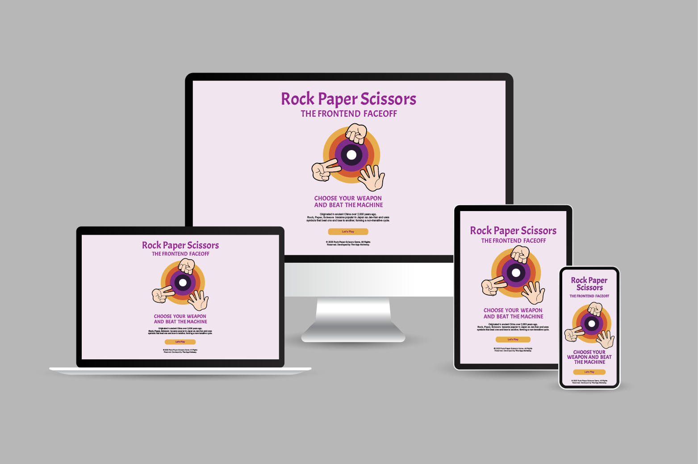

# Rock-Paper-Scissors-The-Frontend-Challenge
(Developer: Dean Isaac)

Milestone Project 2: Rock Paper Scissors Game An interactive Rock Paper Scissors game built with HTML, CSS, and JavaScript. It features real-time user interaction, score tracking, and responsive design, showcasing core frontend development skills.

[Live webpage](https://disaac318.github.io/Rock-Paper-Scissors-The-Frontend-Challenge/)

## Table of Content

- [Rock-Paper-Scissors-The-Frontend-Challenge](#rock-paper-scissors-the-frontend-challenge)
  - [Table of Content](#table-of-content)
  - [Project Goals](#project-goals)
    - [User Goals](#user-goals)
    - [Site Owner Goals](#site-owner-goals)
  - [User Experience](#user-experience)
    - [Target Audience](#target-audience)
    - [User Requirements and Expectations](#user-requirements-and-expectations)
    - [User Stories](#user-stories)
      - [What I need to know as a First-time User](#what-i-need-to-know-as-a-first-time-user)
      - [What I need to know as Returning Customer](#what-i-need-to-know-as-returning-customer)
  - [Testing User Stories from User Experience (UX) Section](#testing-user-stories-from-user-experience-ux-section)
    - [First Time User Experience](#first-time-user-experience)
      - [As a first-time user exploring the website, I want a clear and straightforward understanding of what the website offers.](#as-a-first-time-user-exploring-the-website-i-want-a-clear-and-straightforward-understanding-of-what-the-website-offers)
      - [As a first-time user exploring the website, I want to understand what to expect during my stay and seek information and confirmation that my investment will result in a satisfactory and enjoyable experience.](#as-a-first-time-user-exploring-the-website-i-want-to-understand-what-to-expect-during-my-stay-and-seek-information-and-confirmation-that-my-investment-will-result-in-a-satisfactory-and-enjoyable-experience)
      - [As a first-time user exploring the website, I want to know the accessibility and assess the area's safety and security, particularly for those unfamiliar with the neighbourhood or travelling alone.](#as-a-first-time-user-exploring-the-website-i-want-to-know-the-accessibility-and-assess-the-areas-safety-and-security-particularly-for-those-unfamiliar-with-the-neighbourhood-or-travelling-alone)
      - [As a first-time user exploring the website, I want clear pricing information that helps me decide whether the resort fits my budget.](#as-a-first-time-user-exploring-the-website-i-want-clear-pricing-information-that-helps-me-decide-whether-the-resort-fits-my-budget)
    - [Returning User Experience](#returning-user-experience)
      - [As a returning user, I want to receive regular updates about the latest news, events, and developments at the resort.](#as-a-returning-user-i-want-to-receive-regular-updates-about-the-latest-news-events-and-developments-at-the-resort)
  - [Design](#design)
    - [Design Choices](#design-choices)
    - [Colour](#colour)
    - [Fonts](#fonts)
    - [Structure](#structure)
    - [Wireframes](#wireframes)
  - [Technologies Used](#technologies-used)
    - [Languages](#languages)
    - [Frameworks \& Tools](#frameworks--tools)
  - [Features](#features)
    - [Landing Card (Welcome Interface)](#landing-card-welcome-interface)
    - [The Hero Page](#the-hero-page)
    - [Carousel](#carousel)
    - [Newsletter](#newsletter)
    - [Customers Reviews](#customers-reviews)
    - [Footer](#footer)
    - [Our Services](#our-services)
    - [About Us](#about-us)
    - [Contact Us](#contact-us)
  - [Validation](#validation)
    - [HTML Validation](#html-validation)
    - [CSS Validation](#css-validation)
    - [Performance](#performance)
    - [Performing tests on various devices](#performing-tests-on-various-devices)
    - [Browser compatibility](#browser-compatibility)
  - [Deployment](#deployment)
  - [Credits](#credits)
    - [Media](#media)
    - [Code](#code)
  - [Acknowledgements](#acknowledgements)

## Project Goals 

### User Goals
- Seek a resort that offers a serene and tranquil atmosphere while considering budget constraints.
- Look for affordable options that still provide a peaceful escape and offer amenities conducive to relaxation.
- Explore resorts that offer cooling amenities like swimming pools, jacuzzis, or air-conditioned accommodations at a reasonable price.
- Consider the overall value of the resort's amenities in relation to the price paid for accommodation.
- Look for resorts with spa and wellness facilities that offer rejuvenating treatments at competitive prices.
- Consider package deals or discounts for spa services to maximize value for money while ensuring relaxation and rejuvenation.
- Seek resorts offering outdoor activities and recreational options in scenic surroundings conducive to relaxation and rejuvenation.
- Look for nearby natural attractions or scenic spots that offer opportunities for hiking, yoga, meditation, or other outdoor activities.
- Explore resorts with healthy dining options that offer nutritious meals at reasonable prices.
- Consider the affordability of menu items and dining packages while ensuring they align with dietary preferences and wellness goals.

### Site Owner Goals
- Provide easy-to-use online booking systems or reservation forms to facilitate bookings directly through the website.
- Highlight the various services, amenities, and event spaces available at the resort, catering to different types of guests and events.
- Showcase the resort's unique features, such as accommodations, dining options, recreational activities, and wellness facilities.
- Increase the visibility of the resort's brand among potential customers through compelling imagery, descriptive content, and engaging storytelling.
- Position the resort as a premier destination for leisure travel, special events, and wellness retreats, fostering brand recognition and loyalty.
- Provide informative content and resources to engage with current and potential customers, addressing their inquiries and needs effectively.
- Offer personalized experiences and exceptional customer service to enhance guest satisfaction and encourage repeat visits and referrals.
- Generate revenue growth by promoting special packages, deals, and promotions for accommodations, events, and amenities.
- Optimize the website for search engines (SEO) and mobile devices to attract organic traffic, increase conversions, and maximize profitability.

## User Experience

### Target Audience
- Individuals and families seeking leisure travel options for vacations, weekend getaways, or holiday retreats.
- Individulas interested in accommodations, amenities, nearby attractions, and recreational activities offered by the resort.
- Potential customers for booking accommodations and exploring special packages or promotions.
- Businesses, organizations, and individuals planning events such as weddings, corporate retreats, conferences, or special occasions.
- Interested in event spaces, catering services, audio-visual equipment, and event planning assistance offered by the resort.
- Potential clients for hosting events and utilizing the resort's facilities for various occasions.
- Individuals seeking relaxation, rejuvenation, and wellness experiences.
- Interested in spa facilities, wellness programs, yoga retreats, meditation sessions, and healthy dining options offered by the resort.
- Potential guests looking to book spa treatments, wellness packages, or wellness-focused stays.
- Couples and families looking for romantic escapes, family-friendly accommodations, or rejuvenating getaways.
- Interested in amenities such as swimming pools, spa services, outdoor activities, and family-friendly dining options offered by the resort.
- Potential guests interested in booking accommodations, exploring family packages, or planning special occasions.
- Residents of the surrounding area interested in hosting local events, attending community gatherings, or utilizing the resort's facilities for special occasions.
- Interested in event spaces, catering services, and amenities offered for community events, celebrations, or gatherings.
- Potential clients for hosting local events, attending community functions, or accessing resort amenities for special occasions.

### User Requirements and Expectations

- Users expect to find comprehensive details about accommodations, event spaces, amenities, dining options, and recreational activities offered by the resort.
- They require accurate descriptions, specifications, and pricing information to make informed decisions about bookings and reservations.
- Users expect an intuitive website navigation system that allows them to easily find the information they need.
- They require a user-friendly interface with clear menu structures, clickable links, and intuitive search functionality to navigate the website effortlessly.
- Users expect visually appealing imagery, videos, and multimedia content that showcase the resort's facilities, amenities, and experiences.
- They require engaging and informative content, including descriptive text, testimonials, reviews, and interactive elements to captivate their interest and imagination.
- Users expect a responsive website design that adapts seamlessly to different devices and screen sizes, including desktops, laptops, tablets, and smartphones.
- They require mobile compatibility and optimized performance to access the website on-the-go and easily browse, book, or interact with the resort's offerings.
- Users expect a secure and seamless booking process that allows them to make reservations for accommodations, event spaces, dining options, or recreational activities with confidence.
- They require secure payment options, encryption protocols, and data privacy measures to protect their personal and financial information during online transactions.
- Users expect personalized experiences tailored to their preferences, interests, and previous interactions with the resort.
- They require responsive customer support channels, including live chat, email, or phone support, to address inquiries, resolve issues, and provide assistance throughout the booking process and their stay.
- Users expect an accessible website design that accommodates users with disabilities or special needs, including assistive technologies and accessibility features.
  

### User Stories

#### What I need to know as a First-time User 
1. Introduction to the resort, including its name, location, and a brief description of its offerings and amenities.
2. Overview of the resort's unique features, such as its setting, ambiance, and special attractions.
3. Description of the types of accommodations available (e.g., rooms, suites, villas), including details about room sizes, amenities, and views.
4. Information about special features or upgrades available for accommodations, such as ocean views or private balconies.
5. Pricing information and availability for accommodations, including any special packages or discounts offered.
6. Overview of the resort's amenities and facilities, including swimming pools, spa services, fitness centers, dining options, and recreational activities.
7. Detailed descriptions of each amenity, including operating hours, locations, and any additional costs or reservations required.
8. Information about family-friendly amenities, such as children's playgrounds, kids' clubs, or babysitting services.
9. Description of the event spaces available for weddings, conferences, meetings, parties, and other special occasions.
10. Details about event planning services, catering options, audio-visual equipment, and other amenities offered for events.
11. Pricing information and availability for booking event spaces and services, including any packages or customizable options available.
12. Overview of the resort's spa and wellness facilities, including massage therapies, body treatments, facials, and relaxation amenities.
13. Pricing information and availability for booking spa treatments, wellness packages, or wellness-focused stays.
14. Information about on-site dining options, including restaurants, cafes, bars, and room service menus.
15. Description of the cuisine styles offered, special dining experiences, and any dietary accommodations available.
16. Pricing information for dining options, including menu items, meal packages, and any special promotions or discounts offered.
17. Highlights of nearby attractions, landmarks, and outdoor activities available for guests to explore during their stay.
18. Recommendations for dining, shopping, and entertainment options in the surrounding area.
19. Instructions for booking accommodations, event spaces, dining reservations, spa treatments, or recreational activities directly through the website.
20. Details about the booking process, including payment methods, cancellation policies, and any required deposits or fees.
21. Contact information for customer support or reservations assistance, including phone numbers, email addresses, and operating hours.

#### What I need to know as Returning Customer
1. Updates on any new promotions, discounts, or special offers available for accommodations, dining, spa services, or recreational activities.
2. Details about loyalty programs, rewards, or incentives for returning customers, including exclusive perks or benefits.
3. Information about upcoming events, workshops, or activities hosted by the resort, such as wellness retreats, themed dinners, live entertainment, or seasonal celebrations.
4. Notices about any changes or updates to resort amenities, facilities, or services since your last visit, such as renovations, expansions, or new additions.
5. Information about any temporary closures, maintenance schedules, or renovations affecting specific areas or amenities.
6. Personalized recommendations based on your previous interactions and preferences, such as favorite dining options, preferred room types, or preferred activities.
7. Customized suggestions for activities, excursions, or experiences tailored to your interests and past bookings.
8. Updates on your loyalty and rewards program status, including points earned, rewards redeemed, and any upcoming benefits or privileges.
9. Opportunities to provide feedback and reviews about your previous experiences at the resort, including accommodations, dining, spa services, and overall satisfaction.
10. Access to guest testimonials, reviews, or ratings from other customers to help inform your decisions and enhance future stays.
11. Contact information for customer support or guest services, including phone numbers, email addresses, and live chat options for assistance with reservations, inquiries, or special requests.
12. Information about dedicated customer service representatives or concierge services available to assist with any questions or concerns during your stay.

## Testing User Stories from User Experience (UX) Section
    
### First Time User Experience
#### As a first-time user exploring the website, I want a clear and straightforward understanding of what the website offers.
- 	Users are greeted with a welcoming introduction that includes the resort's name and location, giving them a clear sense of where they might be staying.  
- 	The hero page receives first-time users with a brief introduction about the resort with the slogan “ Relax, Refresh, Reunite!   First-time visitors can expect a serene and rejuvenating environment where they can unwind and de-stress. Visitors can anticipate a variety of amenities and activities designed for relaxation and wellness, such as spa services, swimming pools, and tranquil settings. Additionally, they can look forward to opportunities for reconnecting with loved ones through family-friendly activities, dining options, and communal spaces that foster togetherness.
- The home page features carousels of images that describe various accommodations available, such as rooms, suites, and villas, with specifics about room sizes, amenities, and views.

#### As a first-time user exploring the website, I want to understand what to expect during my stay and seek information and confirmation that my investment will result in a satisfactory and enjoyable experience.
- The homepage features customers reviews section where the first-time user can rely on reviews to build trust in the resort's quality and reliability. Authentic feedback from previous guests reassures them that the resort meets their expectations.
- Reviews offer real-life experiences from other guests, providing first-time users a realistic understanding of what to expect during their stay. This includes details about amenities, service quality, and overall atmosphere.
- Choosing a new resort involves uncertainty. Reviews help reduce this by providing additional information and confirming that others have had positive experiences, making first-time users feel more confident in their choice.

#### As a first-time user exploring the website, I want to know the accessibility and assess the area's safety and security, particularly for those unfamiliar with the neighbourhood or travelling alone.
- At the bottom of the page, the footer section offers first-time users access to essential details about the resort's physical location, contact person, phone number, and email address. Here, visitors can swiftly communicate or submit inquiries, ensuring prompt responses to their needs.
- Knowing the location allows first-time users to assess how easily they can reach the resort, whether by car, public transportation, or other means. This is particularly important for travellers who may be unfamiliar with the area.  The site's Contact Us page has full information about the location.  It features an interactive map that allows users to zoom in and out, explore different views (such as satellite or street view), and click on points of interest for more information.
- It helps users get directions and navigate to the resort, often integrating with GPS and navigation apps for real-time guidance.

#### As a first-time user exploring the website, I want clear pricing information that helps me decide whether the resort fits my budget.
- The website has dedicated pricing information on our services page. First-time users can easily find it through the navigation link at the top of the website. 
- Our services page has Detailed pricing that can highlight the value and inclusions of different packages or deals, showcasing what guests will receive for their money.
- It provides transparency about the costs associated with accommodations, amenities, and services, helping to set realistic expectations for potential guests.
- The Contact Us page also provide an easy way for visitors to contact the business, whether for inquiries, support, feedback, or reservations.  It encourages visitors to reach out through inquiries, feedback, or service requests, fostering a more interactive relationship with the audience.

### Returning User Experience
#### As a returning user, I want to receive regular updates about the latest news, events, and developments at the resort.

- The home page offers newsletter to regularly communicates with the subscribers  about important updates, such as new amenities, changes in services, or upcoming events, directly to subscribers.
- The newsletter also highlights special offers, discounts, and promotions, encouraging bookings and repeat visits.
- The newsletter informs subsribers about any temporary closures, maintenance schedules, price updates, additional amenities or renovations affecting specific areas or amenities.
    

## Design

### Design Choices
The webpage was designed to reflect the unique ambiance, atmosphere, and offerings of the resort while providing a seamless and engaging user experience.  Designs considerations are carefully studied to enhance the visual appeal, usability, and effectiveness of the resort webpage:

1. Use high-quality, captivating imagery that showcases the beauty and ambiance of the resort, including scenic views, accommodations, amenities, and recreational activities. Incorporate professional photography and videos to create a visually stunning impression.
2. Opt for a clean and intuitive layout that guides users seamlessly through the website, with clear navigation menus, clickable buttons, and easily accessible information. Prioritize simplicity and clarity to enhance user experience and reduce clutter.
3. Ensure the resort's website is responsive and mobile-friendly, adapting seamlessly to different devices and screen sizes, including desktops, laptops, tablets, and smartphones. Utilize responsive design techniques to optimize layout, content, and functionality for each device.
4. Incorporate distinct branding elements that reflect the personality, values, and identity of your resort, including logo, color scheme, typography, and visual style. Maintain consistency across all design elements to reinforce brand recognition and credibility.
5. Present content in an engaging and visually appealing manner, with concise headlines, descriptive text, and multimedia elements. Utilize storytelling techniques to evoke emotions and connect with users on a personal level.
6. Incorporate interactive features and elements that encourage user engagement and interaction, such as photo galleries, sliders, interactive maps, virtual tours, and booking widgets. Provide opportunities for users to explore and interact with your resort's offerings.
7. Streamline the booking and reservation process with user-friendly forms, intuitive interfaces, and clear calls-to-action. Implement secure payment gateways and encryption protocols to ensure a seamless and secure transaction experience for users.
8. Showcase social proof and testimonials from satisfied guests to build trust and credibility. Include guest reviews, testimonials, ratings, and endorsements prominently on your website to reassure potential guests and inspire confidence.
9. Optimize website performance for fast loading times, smooth navigation, and efficient functionality. Minimize unnecessary elements, optimize images and videos, and leverage caching and compression techniques to improve page speed and performance.

### Colour
The resort aims to evoke a sense of tranquility and renewal, mirroring the calming effects of water. It offers guests an immersive experience where they feel rejuvenated and refreshed by the resort's aquatic elements, from serene pools and cascading waterfalls to soothing spa treatments inspired by the ocean's therapeutic powers. 

To create my color palette, I drew inspiration from the color of the water and decided to use Canva's Water Foam color combination.  https://www.canva.com/colors/color-palettes/water-foam/

 

### Fonts

Montserrat was used for the body and Bebas Neue for the headings. Both fonts are considered dyslexia friendly.

### Structure
The website is structured to provide easy access to essential information and features, ensuring a seamless user experience. It typically includes the following pages: 
- A homepage providing an overview of the resort's offerings, amenities, and highlights, often featuring captivating imagery and key call-to-action buttons for booking or exploring further.  The section also features invitation for newsletter for updates, tips and future promotions.  It also showcases a gallery of images highlighting the resort's features, amenities, and guest experiences, along with testimonials, reviews, and ratings from satisfied guests.
- A sevices page describing what the resort offers and the operating hours and prices.
- An about page provide visitors with a comprehensive understanding of the resort's identity, values, and offerings, fostering trust, credibility, and connection with potential guests.
- A contact page with a contact form, a map and information about the bussines section

### Wireframes

Desktop

Tablet

Phone

## Technologies Used

### Languages
- HTML
- CSS
- Javascript
- Bootstrap 5.0

### Frameworks & Tools
- Bootstrap v5.0
- Git
- GitHub
- Illustrator
- Google Fonts
- Canva Color

## Features
A single-page layout is used, with a flip effect that transitions into the main game environment.

### Landing Card (Welcome Interface)
  The application opens with a visually engaging landing card, designed to welcome the player and introduce the Rock-Paper-Scissors game. This card serves as the entry point to the gameplay experience and includes:

- A brief title and subtitle to establish the game’s theme.
- A “Start Game” button that triggers a smooth flip animation, transitioning the interface into the main game screen.
- Responsive and styled using Bootstrap and CSS.
- Purposefully minimalist to maintain focus and provide a clean first impression.
The transition from this card to the game interface is seamless, enhancing user engagement through an animated card-flip effect that simulates a dynamic and interactive experience—all while keeping the app as a single-page application (SPA).

- Featured on all four pages

### The Hero Page
- The hero page for the resort serves as the captivating gateway to the website, inviting visitors to immerse themselves in the beauty and luxury of the resort. 
- Featuring stunning imagery of the resort, inviting accommodations, and indulgent amenities, the hero page sets the stage for an unforgettable getaway experience. 
- Concise and compelling messaging entices guests to explore further, promising relaxation and unforgettable memories amidst serene surroundings.
  
  

### Carousel
- Introduces the user to the restaurant with ten pictures slide show
- Options for the user to navigate the slide show via back and forward arrows or indicators at the bottom
- It also serves as the Resort's Photo Gallery
  

### Newsletter
- The site's newsletter aims to establish and maintain a direct line of communication with subscribers, keeping them informed, engaged, and connected with the resort. 
- The newsletter aims to nurture relationships with subscribers, encourage repeat visits, and drive bookings and reservations by regularly sending updates, promotions, special offers, and exclusive content via email.
- The newsletter serves as a valuable marketing tool for promoting new amenities, events, and packages, enhancing brand awareness, and fostering loyalty among subscribers. 

### Customers Reviews
- Reviews provide valuable feedback for the resort, highlighting areas of strength and areas for improvement. This allows the resort to address any issues guests raise and continuously improve its offerings and services.
- Positive reviews from satisfied guests build trust and credibility for the resort. Potential guests are more likely to trust the opinions and experiences of fellow travellers when making booking decisions.
- Reviews significantly influence purchasing decisions. Potential guests often rely on reviews to gauge the quality and reputation of the resort before making a reservation.
- Reviews offer insight into the guest experience, including what guests liked or disliked about their stay. This helps potential guests understand what to expect and whether the resort meets their preferences and needs.
- Positive reviews can be leveraged for marketing and promotion purposes. They can be featured on the resort's website, social media channels, and marketing materials to showcase its reputation and attract new guests.

### Footer
- Featured on all four pages
- Consists of contact information and social media links

### Our Services
- Describes the glimpse of what the resort have to offer, along with our opening hours and pricing details

### About Us
- serves as a platform to introduce the resort, sharing its inspiration, mission and visions.
-  It aims to foster trust, connection, and understanding between the resort and potential guests, providing insights into its identity and ethos.

### Contact Us
- Provides contact information, including location details, for inquiries, feedback, and assistance.
-  Provides visitors with essential information about where the resort is situated. It typically includes details such as the resort's physical address, a map showing its location, and possibly directions or nearby landmarks. 
-  Allows visitors to easily send messages, inquiries, or feedback directly to the resort's team. It typically collects essential information such as the visitor's name, email address, and message, enabling the resort to respond promptly and effectively to their inquiries or requests. 

## Validation

### HTML Validation
The W3C Markup Validation Service was used to validate the HTML of the website. All pages pass with no errors no warnings to show.

Home

Our Services

About Us

Contact Us

### CSS Validation

style.css

### Performance 
Google Lighthouse in Google Chrome Developer Tools was used to test the performance of the website. 

Home

Our Services

About Us

Contact Us

### Performing tests on various devices 
The website was tested on the following devices:
- Imac 24-inch M1 2021
- Ipad Pro 2021
- Apple Iphone 14 Pro
- Lenovo ThinkPad X13 

In addition, the website was tested using Google Chrome Developer Tools Device Toggeling option for all available device options.

### Browser compatibility
The website was tested on the following browsers:
- Safari
- Google Chrome
- Mozilla Firefox
- Microsoft Edge

## Deployment
The website was deployed using GitHub Pages by following these steps:
1. In the GitHub repository navigate to the Settings tab
2. On the left hand menu select Pages
3. For the source select Branch: master
4. After the webpage refreshes automaticaly you will se a ribbon on the top saying: "Your site is live at https://disaac318.github.io/Casa-Correa-Resort/"

## Credits
Images not referenced below are owned by the developer.

### Media
In order of appearance:
- [About Us](assets/images/ima2.jpeg): Photo by <a href="https://stock.adobe.com/uk/contributor/205314365/art-photo?load_type=author&prev_url=detail">Art_Photo</a> on <a href="https://stock.adobe.com/uk/images/portrait-of-beauty-asian-woman-read-the-paper-book-work-study-and-looking-at-page-magazine-while-sitting-in-swimming-pool-on-summer-travel-vacation-relaxing-at-resort-spa/431438993">Adobe Stock</a>  on standard license.
- [Contact Us](assets/images/ima1.jpeg): Photo by <a href="https://stock.adobe.com/uk/contributor/206922540/wavebreak3?load_type=author&prev_url=detail"> wavebreak3</a> on <a href="https://stock.adobe.com/uk/images/happy-diverse-group-of-friends-having-pool-party-playing-guitar-in-garden/592438929">Adobe Stock</a>  on standard license.

  
### Code

- The HTML for the responsive [Navbar with toggler](https://getbootstrap.com/docs/5.0/components/navbar/#toggler) was taken from the Bootstrap v5.0 documentation code snippet
- [Carousel](https://getbootstrap.com/docs/5.0/components/carousel/#with-indicators) on index page was taken from Bootrap v5.0 documentation code snippet

## Acknowledgements
I would like to take the opportunity to thank wife who owns the newly constucted private resort which inspired me to create this website for future use.