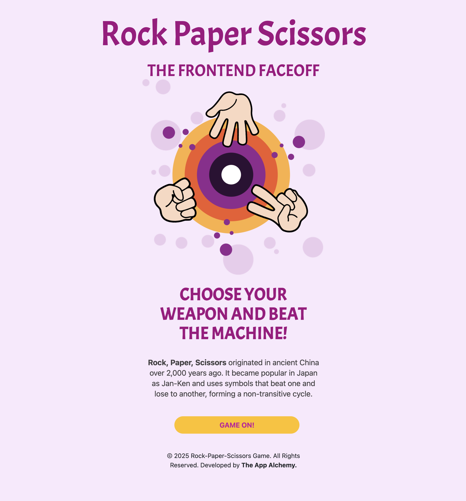
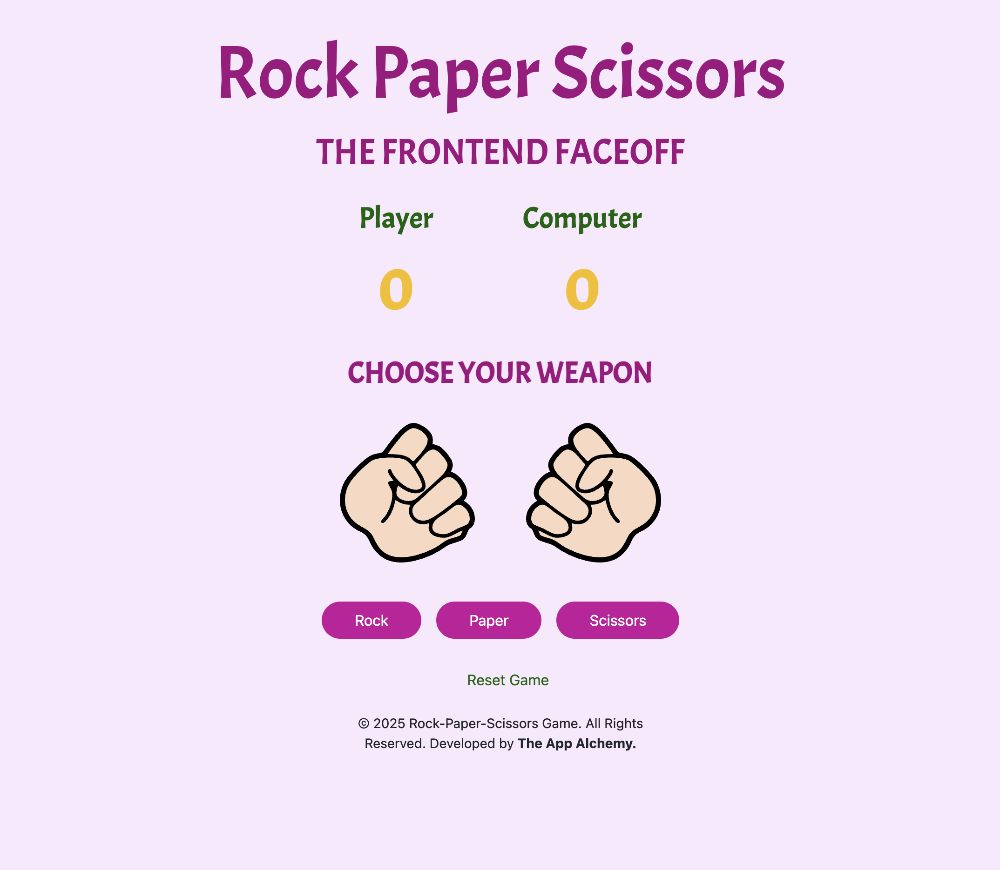
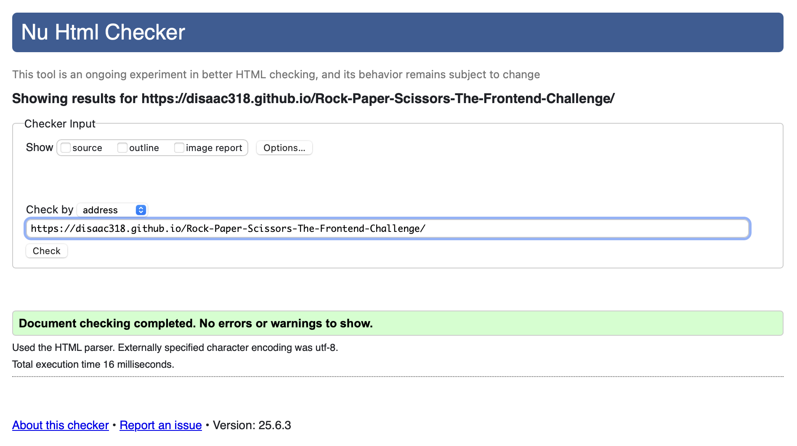
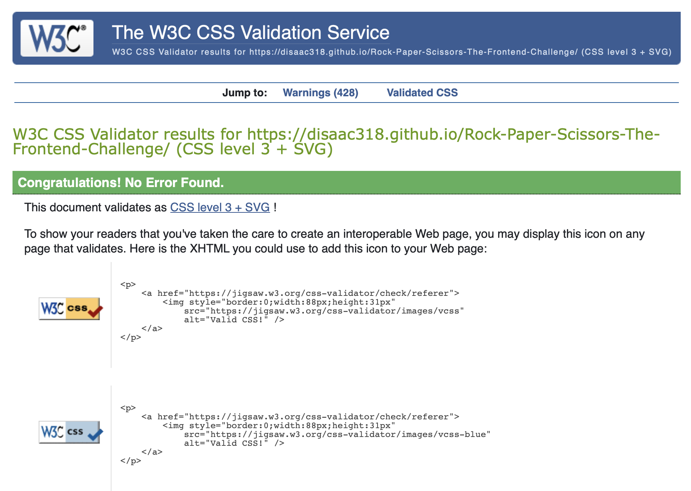
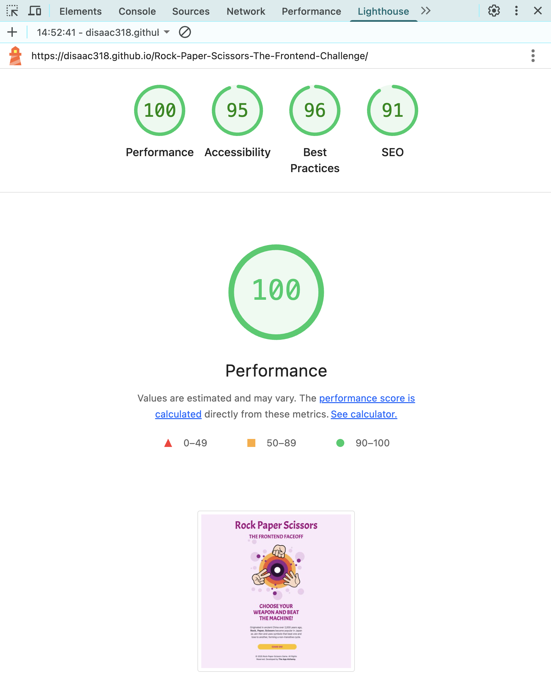

# Rock-Paper-Scissors-The-Frontend-Challenge
(Developer: Dean Isaac)

Milestone Project 2: Rock Paper Scissors Game An interactive Rock Paper Scissors game built with HTML, CSS, and JavaScript. It features real-time user interaction, score tracking, and responsive design, showcasing core frontend development skills.

[Live webpage](https://disaac318.github.io/Rock-Paper-Scissors-The-Frontend-Challenge/)

## Table of Content

- [Rock-Paper-Scissors-The-Frontend-Challenge](#rock-paper-scissors-the-frontend-challenge)
  - [Table of Content](#table-of-content)
  - [Project Goals](#project-goals)
    - [🎯 User Goals](#-user-goals)
    - [🧑‍💼 Site Owner’s Goals](#-site-owners-goals)
  - [🎨 User Experience](#-user-experience)
    - [🎯 Target Audience](#-target-audience)
    - [📋 User Requirements and Expectations](#-user-requirements-and-expectations)
    - [User Stories](#user-stories)
      - [What I need to know as a First-time User](#what-i-need-to-know-as-a-first-time-user)
      - [What I need to know as Returning Customer](#what-i-need-to-know-as-returning-customer)
  - [Testing User Stories from User Experience (UX) Section](#testing-user-stories-from-user-experience-ux-section)
    - [First Time User Experience](#first-time-user-experience)
      - [As a first-time user exploring the website, I want a clear and straightforward understanding of what the website offers, so I can decide quickly whether it matches my interest in fun, casual gameplay.](#as-a-first-time-user-exploring-the-website-i-want-a-clear-and-straightforward-understanding-of-what-the-website-offers-so-i-can-decide-quickly-whether-it-matches-my-interest-in-fun-casual-gameplay)
      - [As a first-time user exploring the website, I want to understand what to expect during my stay and seek information and confirmation that my investment will result in a satisfactory and enjoyable experience.](#as-a-first-time-user-exploring-the-website-i-want-to-understand-what-to-expect-during-my-stay-and-seek-information-and-confirmation-that-my-investment-will-result-in-a-satisfactory-and-enjoyable-experience)
  - [Design](#design)
    - [Design Choices](#design-choices)
    - [Colour](#colour)
    - [Fonts](#fonts)
    - [Wireframes](#wireframes)
  - [Technologies Used](#technologies-used)
    - [Languages](#languages)
    - [Frameworks \& Tools](#frameworks--tools)
  - [Features](#features)
    - [🃏 Landing Card (Welcome Interface)](#-landing-card-welcome-interface)
    - [🎮 Flip Card 2 (Main Game Interface)](#-flip-card-2-main-game-interface)
  - [Validation](#validation)
    - [HTML Validation](#html-validation)
    - [CSS Validation](#css-validation)
    - [Performance](#performance)
    - [JS Lint](#js-lint)
    - [Performing tests on various devices](#performing-tests-on-various-devices)
    - [Browser compatibility](#browser-compatibility)
  - [Deployment](#deployment)
  - [Credits](#credits)
    - [Media](#media)
    - [Images](#images)
  - [Acknowledgements](#acknowledgements)

## Project Goals 

### 🎯 User Goals
- Play a simple, fun, and fast-paced game to relax or take a short mental break.
- Challenge a computer opponent in a familiar game that requires quick thinking and strategy.
- Enjoy a playful and visually engaging experience without needing to learn complex rules.
- Compete against an AI with increasing difficulty to improve decision-making and prediction skills.
- Track your progress with scores and round history, building a sense of achievement over time.
- Enjoy the satisfaction of immediate visual and sound feedback with each win or round result.
- Use the game as a light form of competition with friends or to simply pass time enjoyably.
- Access a game that’s easy to play on any device — whether at home, during study breaks, or on the go.
- Feel rewarded through engaging animations, effects, and theme customisation options.
- Revisit the game multiple times thanks to its replayable nature and short, satisfying gameplay cycles.

### 🧑‍💼 Site Owner’s Goals
- Design and develop a fully functional Rock-Paper-Scissors game that demonstrates strong command of JavaScript, HTML, CSS, and responsive design principles.
- Showcase proficiency in front-end development by integrating animation, interactivity, and a polished user interface within a single-page application.
- Apply modern development practices such as ES6 code structure, event-driven programming, and component reusability.
- Implement visual feedback mechanisms (e.g., transitions, score animations, and win celebrations) to enhance user engagement.
- Ensure the project reflects a high standard of accessibility, mobile responsiveness, and UI/UX design thinking.
- Provide a smooth and enjoyable gameplay experience that encourages replayability and user retention.
- Use this project as a portfolio piece to demonstrate technical capability, creativity, and a clear understanding of user-centered design.
- Incorporate testing (e.g., Jest) to show commitment to software quality and maintainability.
- Create clear and well-documented code that is easy to understand, extend, and maintain for future development or enhancement.

## 🎨 User Experience
The Rock-Paper-Scissors game is designed to provide an engaging and intuitive experience that balances simplicity with dynamic interactivity. Users are immediately drawn in by smooth animations, clear visual cues, and responsive controls that make gameplay enjoyable on any device. The interface supports quick decision-making through easily recognizable icons and provides immediate feedback via score updates, sound effects, and celebratory animations, fostering a rewarding sense of achievement.   Overall, the experience is crafted to be accessible to users of all skill levels, encouraging repeat play through its polished design and seamless flow.

### 🎯 Target Audience
- Casual gamers seeking a quick, entertaining distraction during breaks or downtime.
- Beginners to gaming who appreciate simple, rule-light games with straightforward mechanics.
- Students and professionals looking for a brief mental refresher or stress-relief tool.
- Mobile users who want a fully responsive game playable across smartphones, tablets, and desktops.
- Learners and hobbyist developers interested in frontend development concepts demonstrated through practical, interactive projects.
- Anyone looking to enjoy a classic game with modern UI enhancements and AI challenge options.

### 📋 User Requirements and Expectations

- Easy and intuitive gameplay: Users expect a straightforward interface where they can quickly understand how to play without prior instructions.
- Responsive design: The game must work seamlessly across a range of devices, including smartphones, tablets, and desktops, adapting layout and controls accordingly.
- Clear feedback: Users require immediate visual and auditory feedback after each move, including round outcomes, score updates, and celebratory effects when winning.
- Smooth transitions: Animations such as card flips and gesture feedback should be fluid and not disrupt the flow of the game.
- Replayability: Users expect to easily reset or start new games.
- Accessibility: Controls and visuals must be clear, legible, and usable by players with varying abilities, including appropriate contrast and button sizes.
- Performance: The game should load quickly and run smoothly without bugs or lag, ensuring a frustration-free experience.
- Privacy and security: Users expect that the game runs entirely client-side, without collecting personal data or requiring internet connectivity.
  

### User Stories

#### What I need to know as a First-time User 
1. I want to easily understand how to play Rock-Paper-Scissors without reading lengthy instructions, so I can start the game quickly.
2. I want clear, visually distinct buttons for Rock, Paper, and Scissors, so I can confidently make my choice.
3. I want real-time feedback showing which choice I made and what the computer chose, so I can follow the outcome clearly.
4. I want to see my current score and the computer’s score displayed prominently, so I can track the progress of the game.
5. I want the game to respond smoothly on my device (phone, tablet, or desktop), so I can play comfortably anywhere.
6. I want the option to reset or start a new game easily, so I can play multiple rounds without confusion.
7. I want simple sound and visual effects that enhance the experience without being distracting.
8. I want to know that my data and privacy are protected, so I can play without concern.

#### What I need to know as Returning Customer
1. I want to jump straight into the game without needing to relearn how it works, so I can enjoy quick, familiar gameplay.
2. I expect the interface to be consistent and responsive across devices, so I can continue playing on mobile, tablet, or desktop with ease.
3. I expect the game to load quickly and run smoothly, so I can immediately begin playing without interruptions.
4. I want visual and sound feedback to remain sharp and rewarding, maintaining the excitement of each round.
5. I want reliable performance with no bugs or crashes, so I can trust the experience every time I revisit.

## Testing User Stories from User Experience (UX) Section
    
### First Time User Experience
#### As a first-time user exploring the website, I want a clear and straightforward understanding of what the website offers, so I can decide quickly whether it matches my interest in fun, casual gameplay.
- 	The landing page includes a concise headline (e.g., "Choose your weapon and beat the Machine.") that clearly explains the site's purpose.
- A short subheading or paragraph summarises the game (e.g., "Challenge the AI in this animated, responsive version of the classic game. No login needed.").
- Prominent call-to-action (e.g., “Start Game” or “Flip to Play”) is visible without scrolling.
- Flipcard animation or welcome message provides context before transitioning to gameplay.
- The interface is intuitive, requiring no prior instructions to navigate.

#### As a first-time user exploring the website, I want to understand what to expect during my stay and seek information and confirmation that my investment will result in a satisfactory and enjoyable experience.
- The website clearly communicates its purpose (e.g., "A fun and visually engaging Rock-Paper-Scissors game you can play anytime").
- Visual elements (like animated cards or icons) indicate interactivity, fun, and ease of use.
- Gameplay interface appears modern, polished, and inviting, with clear progression (e.g., animation, scoring).
- Positive micro-interactions (sound effects, score feedback, gesture animations) enhance the sense of enjoyment.
- No ads, distractions, or misleading links that could erode user trust.

## Design

### Design Choices
The Rock-Paper-Scissors (RPS) game was designed to offer an engaging, responsive, and visually appealing user experience while reflecting the classic simplicity and instant appeal of the original hand game. Key design considerations focused on intuitive interaction, game flow clarity, and playful aesthetics, ensuring both first-time and returning users can navigate and enjoy the platform with ease.

1. **Animated Flipcard Interface.**  The landing page is structured as a single card that flips seamlessly into the game view. This introduces a minimalist one-page layout that reduces cognitive load and creates a dynamic transition between introduction and gameplay, reinforcing the immediacy of the experience.
   

2. **Mobile-First Responsive Design.**   The interface is fully responsive across all screen sizes and devices. Whether accessed via desktop, tablet, or smartphone, the layout adapts proportionally to ensure that game buttons, scores, and animations remain accessible and visually balanced.
3. **Bold, Playful Aesthetics.**  A lively color scheme—complemented by high-contrast light and dark themes—ensures strong visual clarity and aligns with the energetic nature of the game. These theme options also improve accessibility and personalisation.
4. **Intuitive Interaction and Feedback.**  Visual icons for hand gestures (rock, paper, scissors) are supported by hover states, click animations, and auditory feedback, creating a responsive environment that mimics real-world hand game interactions. 
5. **Micro-Interactions and Transitions.**   Subtle motion effects and transition animations (such as card flips, gesture reveals, and score changes) are used to enhance the perceived quality of the interface, without overwhelming the user or detracting from core functionality.
6. **No-Frills Navigation and Replayability.**  Users are provided with clear calls-to-action (e.g., “ Game On ”, “Reset Game”) and minimal navigation barriers. Game sessions can be restarted instantly, promoting repeat engagement with a single click.
7. **Clean, Minimalist UI.**   All visual elements are positioned to reduce clutter and emphasize gameplay. Icons, scores, instructions, and controls are arranged using a grid layout for balanced spatial alignment and simplicity.
8. **Performance Optimisation.**  Images, animations, and JavaScript modules are optimised for quick loading and smooth transitions. Caching strategies and minimal asset bloat were prioritised to maintain seamless performance, even on slower networks.
9.  **Trustworthy, Distraction-Free Environment.**  The site avoids intrusive elements such as advertisements or unnecessary popups. Users are clearly informed upfront that no personal data, login, or downloads are required, which fosters a sense of trust and openness.

### Colour
The overall color palette creates an inviting and user-friendly interface designed to enhance usability, emotional engagement, and thematic consistency.

**Vibrant Magenta/Purple (#990066 to #b30086 range)**
- Used in: Main headings, buttons (Rock, Paper, Scissors), and titles like “CHOOSE YOUR WEAPON”.
- Psychology: Purple and magenta tones often evoke creativity, excitement, and boldness, which are ideal for a casual yet competitive game. It stands out against lighter backgrounds and draws user focus to the game’s core interactive elements.
- UX Benefit: High contrast against the light background makes buttons and key text highly visible and accessible.

**Soft Lavender/Pastel Pink Background**

- Used in: Background of the entire interface.
Psychology: Light pastel tones provide a calming and non-intimidating atmosphere, which is essential for encouraging casual play and accessibility, especially for younger users or first-time players.
- UX Benefit: This soft hue reduces eye strain while allowing stronger foreground colors (like purple or yellow) to pop effectively.

**Green (#006400 to #228B22)**

- Used in: Labels such as Player, Computer, and the Reset Game link.
- Psychology: Green signifies fair play, progress, and positive action. It reinforces a sense of balance between the player and the computer and subtly invites users to reset and try again.
- UX Benefit: Green is associated with success and restart in digital interfaces, making it intuitive for the user.

**Golden Yellow (#FFD700)**

- Used in: The score count for both Player and Computer.
Psychology: Yellow evokes energy, attention, and alertness, ideal for highlighting dynamic elements like scores.
- UX Benefit: Easily catches the user's eye and signifies real-time change, keeping users informed about game status.

**Black/Grey (#333333)**

- Used in: Footer text for legal and branding content.
- Reasoning: This subtle but readable contrast anchors the footer information without competing with the main content.

### Fonts

**Acme (Headlines & Buttons) — Adds Playfulness**
- Game-like personality: Acme's rounded, bold letterforms convey a fun, casual, and energetic tone—perfect for a game targeting users of all ages, especially younger audiences or casual players.
- Attention-grabbing: Ideal for use in titles like “Rock! Paper! Scissors!”, scoreboard headings, or call-to-action buttons like “Play Again.”
- Web-optimized: Loads fast from Google Fonts and maintains quality on all screen sizes.

**Helvetica (Body, Instructions, UI) — Ensures Clarity**
- Clean and timeless: Helvetica’s neutral design ensures the interface stays readable, even during fast-paced interactions.
- Widely supported: Helvetica is a system font on many devices, which improves performance and reduces font flickering.
- Professional balance: While Acme plays up the fun, Helvetica brings the visual balance and polish your site needs to appear well-structured.

### Wireframes

Desktop

Tablet

Phone

## Technologies Used

### Languages
- HTML
- CSS
- Javascript
- Bootstrap 5.0

### Frameworks & Tools
- Bootstrap v5.0
- Git
- GitHub
- adobe Illustrator
- Google Fonts

## Features
A single-page layout is used, with a flip effect that transitions into the main game environment.

###  🃏 Landing Card (Welcome Interface)
  

  The application opens with a visually engaging landing card, designed to welcome the player and introduce the Rock-Paper-Scissors game. This card serves as the entry point to the gameplay experience and includes:

- A brief title and subtitle to establish the game’s theme.
- A “Start Game” button that triggers a smooth flip animation, transitioning the interface into the main game screen.
- Responsive and styled using Bootstrap and CSS.
- Purposefully minimalist to maintain focus and provide a clean first impression.
  
The transition from this card to the game interface is seamless, enhancing user engagement through an animated card-flip effect that simulates a dynamic and interactive experience—all while keeping the app as a single-page application (SPA).

### 🎮 Flip Card 2 (Main Game Interface)
  

Upon initiating the game, the landing card flips to reveal Flip Card 2, the core gameplay interface. This card presents an intuitive, animated layout where users actively engage in the Rock-Paper-Scissors challenge. Key elements include:

- Animated hand gesture icons for Rock 🪨, Paper 📄, and Scissors ✂️, allowing players to make a selection
- A real-time scoreboard that tracks player and computer scores across rounds
- AI opponent logic, with adjustable difficulty (if implemented).
- Responsive layout using Bootstrap for smooth performance across devices
- Optional sound effects and celebration animations (e.g., confetti or audio) when a player wins a match.

All interactions remain within this single view, preserving the single-page application architecture. This card is where the game logic, UI transitions, and feedback mechanisms converge to deliver an engaging user experience.

## Validation

### HTML Validation
The W3C Markup Validation Service was used to validate the HTML of the website. All pages pass with no errors no warnings to show.

HTML

### CSS Validation

style.css

### Performance 
Google Lighthouse in Google Chrome Developer Tools was used to test the performance of the website. 

Flip Card 1

### JS Lint 

### Performing tests on various devices 
The website was tested on the following devices:
- Imac 24-inch M1 2021
- Ipad Pro 11 2021
- Apple Iphone 14 Pro

In addition, the website was tested using Google Chrome Developer Tools Device Toggeling option for all available device options.

### Browser compatibility
The website was tested on the following browsers:
- Safari
- Google Chrome
- Mozilla Firefox
- Microsoft Edge

## Deployment
The website was deployed using GitHub Pages by following these steps:
1. In the GitHub repository navigate to the Settings tab
2. On the left hand menu select Pages
3. For the source select Branch: master
4. After the webpage refreshes automaticaly you will se a ribbon on the top saying: " Your site is live at https://disaac318.github.io/Rock-Paper-Scissors-The-Frontend-Challenge/ "

## Credits

### Media
All sound effects used in this project were sourced from <a href="https://pixabay.com/sound-effects/">Pixabay</a>, a platform offering high-quality, royalty-free media. I am grateful to the generous creators who share their work freely for public use.

### Images

The visual assets and game illustrations were designed and created by me using Adobe Illustrator. This allowed for a fully customised interface and ensured a cohesive aesthetic that aligns with the interactive and playful nature of the game.

  

## Acknowledgements
This project was developed as part of my learning journey in Diploma in Web Application Development (DIWAD), with significant inspiration drawn from The Odin Project. I extend my sincere thanks to the creators and contributors of The Odin Project for their well-structured curriculum and community-driven resources, which served as a guiding framework throughout this build.

I am also grateful to my mentor for his support and constructive feedback, and to the broader developer community—including Stack Overflow, GitHub, and MDN Web Docs—for the wealth of knowledge and collaborative spirit they provide.

This Rock-Paper-Scissors game reflects both my growing understanding of JavaScript fundamentals and my commitment to writing clean and testable code.